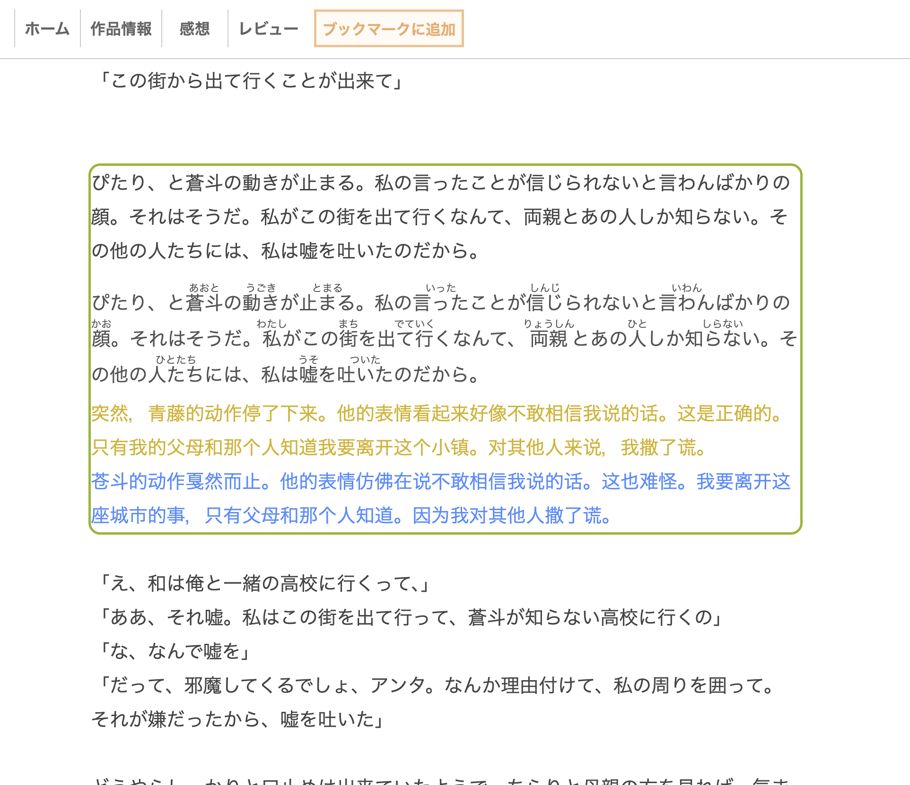

# AnonTranslator Improved


[中文](#中文) | [English](#english)



## 中文

基于 [raindrop213/AnonTranslator](https://github.com/raindrop213/AnonTranslator) 的改进版 Chrome 扩展。它面向日文网页小说、生肉阅读和本地 HTML/EPUB 阅读场景，可以识别网页中的正文段落，复制原文，并使用 Google 或 DeepSeek 翻译。

这个版本重点改进了 DeepSeek 翻译、日语假名标注、段落识别和阅读时的交互体验。

### 功能亮点

- 支持 Google 翻译和 DeepSeek API 翻译。
- DeepSeek 首次翻译时同时返回译文和词语级假名标注，使用真实 `<ruby><rt>` 渲染。
- 假名标注显示在翻译区域中的原文行里，不改写网页原始正文。
- 改进正文段落识别，适配更多小说站点和本地阅读页面。
- 点击段落不会强制滚动居中，阅读位置更稳定。
- 切换段落时保留之前的翻译结果，方便反复回看。
- DeepSeek API Key 只保存在 `chrome.storage.local`，不会通过 Chrome Sync 同步。

### 安装

1. 打开本仓库页面：[Agenlone1y2016/AnonTranslator-improved](https://github.com/Agenlone1y2016/AnonTranslator-improved)。
2. 点击 `Code`，选择 `Download ZIP`，解压到本地。
3. 打开 Chrome 的扩展程序页面：`chrome://extensions/`。
4. 打开右上角的 `开发者模式`。
5. 点击 `加载已解压的扩展程序`，选择解压后的项目文件夹。

也可以使用 Git：

```bash
git clone https://github.com/Agenlone1y2016/AnonTranslator-improved.git
```

然后在 Chrome 中加载克隆出来的文件夹。

### DeepSeek 配置

1. 在 [DeepSeek Platform](https://platform.deepseek.com/) 创建 API Key。
2. 打开扩展设置中的 `Translator > DeepSeek`。
3. 填写 API Key，选择模型并保存。

当前支持的模型：

- `deepseek-v4-flash`
- `deepseek-v4-pro`

### 使用方式

1. 左键点击段落：复制并翻译当前文本段落。
2. 右键点击段落：复制高亮句子。
3. 启用 DeepSeek 时，翻译区域会额外显示带假名标注的原文行。

### 适合场景

- 在线小说站点，例如 [小説家になろう](https://syosetu.com/)、[カクヨム](https://kakuyomu.jp/)。
- 本地 HTML/EPUB 阅读页面。
- 自建书库，例如 Calibre-web。
- 其他以正文段落为主的日文阅读网页。

### 开发与测试

普通用户安装和使用扩展不需要 npm 或 Node.js。只有开发者运行测试时需要 Node.js 20 或更高版本。

```bash
npm test
```

测试会检查：

- `manifest.json` 引用的文件是否存在；
- popup 设置项和默认配置是否一致；
- DeepSeek 模型配置是否同步；
- 翻译切换时是否保留旧段落结果；
- Google/DeepSeek 翻译核心逻辑和错误处理。

### 授权与来源

本项目基于原版 AnonTranslator 修改，保留 MIT License。感谢原作者 [raindrop213](https://github.com/raindrop213) 的开源工作。

---

## English

AnonTranslator Improved is a modified Chrome extension based on [raindrop213/AnonTranslator](https://github.com/raindrop213/AnonTranslator). It is built for reading Japanese web novels, raw Japanese text, and local HTML/EPUB reading pages. The extension can detect readable text blocks on a page, copy the original text, and translate it with Google or DeepSeek.

This version focuses on DeepSeek translation, Japanese furigana rendering, paragraph detection, and a smoother reading flow.

### Highlights

- Supports Google Translate and DeepSeek API translation.
- DeepSeek can return the translation and word-level furigana annotations in the first translation request.
- Furigana is rendered with real `<ruby><rt>` markup.
- Annotated Japanese source text is shown inside the translation area, without rewriting the original page content.
- Improved readable paragraph detection for more novel sites and local reading pages.
- Clicking a paragraph no longer forces the page to scroll to the center.
- Previous paragraph translations stay visible when you move to another paragraph.
- The DeepSeek API key is stored only in `chrome.storage.local` and is not synced through Chrome Sync.

### Installation

1. Open this repository: [Agenlone1y2016/AnonTranslator-improved](https://github.com/Agenlone1y2016/AnonTranslator-improved).
2. Click `Code`, choose `Download ZIP`, and unzip the archive.
3. Open Chrome's extensions page: `chrome://extensions/`.
4. Enable `Developer mode`.
5. Click `Load unpacked` and select the unzipped project folder.

You can also clone the repository:

```bash
git clone https://github.com/Agenlone1y2016/AnonTranslator-improved.git
```

Then load the cloned folder from Chrome's extensions page.

### DeepSeek Setup

1. Create an API key on [DeepSeek Platform](https://platform.deepseek.com/).
2. Open the extension settings and go to `Translator > DeepSeek`.
3. Enter your API key, choose a model, and save.

Supported models:

- `deepseek-v4-flash`
- `deepseek-v4-pro`

### Usage

1. Left-click a paragraph to copy and translate it.
2. Right-click a paragraph to copy the highlighted sentence.
3. When DeepSeek is enabled, the translation area also shows the original Japanese line with furigana annotations.

### Recommended Use Cases

- Japanese web novel sites such as [小説家になろう](https://syosetu.com/) and [カクヨム](https://kakuyomu.jp/).
- Local HTML/EPUB reading pages.
- Self-hosted libraries such as Calibre-web.
- Other Japanese reading pages that are mainly organized as text paragraphs.

### Development And Testing

Users do not need npm or Node.js to install and use the extension. Node.js 20 or newer is only required for developers who want to run the tests.

```bash
npm test
```

The tests check:

- whether every file referenced by `manifest.json` exists;
- whether popup settings match the default settings;
- whether DeepSeek model options stay in sync;
- whether previous paragraph translations are preserved;
- Google and DeepSeek translation core logic and error handling.

### License And Credits

This project is modified from the original AnonTranslator and keeps the MIT License. Thanks to [raindrop213](https://github.com/raindrop213) for the original open-source project.

---


