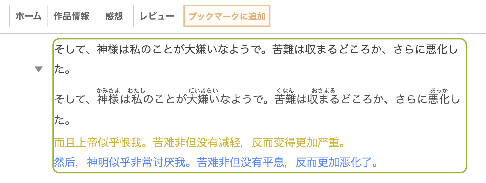

# AnonTranslator II


[中文](#中文) | [English](#english)



## 中文

基于 [raindrop213/AnonTranslator](https://github.com/raindrop213/AnonTranslator) 的二代改进版 Chrome 扩展。它既支持日文网页小说、生肉阅读和本地 HTML/EPUB，也支持对普通网页中的任意选中文本进行常规翻译。

这个版本改进了 DeepSeek 翻译、日语假名标注、段落识别、翻译缓存和阅读时的交互体验。

### 功能亮点

- 面向日文网页小说、本地 HTML/EPUB 和自建书库阅读场景。
- 可即时切换“日语轻小说”和“常规翻译”模式。
- 常规模式仅在手动选中文本后显示翻译按钮，不接管段落点击。
- 支持 Google 翻译和 DeepSeek API 翻译。
- DeepSeek 翻译可同时生成中文译文和日语假名标注。
- 使用 ruby 假名标注辅助阅读，不改写网页原始正文。
- 支持本地缓存翻译结果，刷新页面后可复用已有译文。
- DeepSeek API Key 只保存在 `chrome.storage.local`，不会通过 Chrome Sync 同步。

### 安装

1. 打开本仓库页面：[Agenlone1y2016/AnonTranslator-II](https://github.com/Agenlone1y2016/AnonTranslator-II)。
2. 点击 `Code`，选择 `Download ZIP`，解压到本地。
3. 打开 Chrome 的扩展程序页面：`chrome://extensions/`。
4. 打开右上角的 `开发者模式`。
5. 点击 `加载已解压的扩展程序`，选择解压后的项目文件夹。

也可以使用 Git：

```bash
git clone https://github.com/Agenlone1y2016/AnonTranslator-II.git
```

然后在 Chrome 中加载克隆出来的文件夹。

### DeepSeek 配置

1. 在 [DeepSeek Platform](https://platform.deepseek.com/) 创建 API Key。
2. 打开扩展设置中的 `Translator > DeepSeek`。
3. 填写 API Key，选择模型并保存。

当前支持的模型：

- `deepseek-v4-flash`
- `deepseek-v4-pro`

### 使用方式

1. 在弹窗顶部选择“日语轻小说”或“常规翻译”，切换会立即生效并自动保存。
2. 日语轻小说模式：左键点击段落进行复制和翻译；右键点击高亮句子进行复制。
3. 日语轻小说模式：点击译文旁的小三角可折叠或展开；DeepSeek 会同时显示带假名标注的原文行。
4. 常规翻译模式：手动选中任意连续网页文本，点击选区旁的“译”按钮，在浮层中查看纯译文。
5. 常规译文浮层可按 `Esc`、点击空白处或点击关闭按钮关闭；创建新选区会替换旧结果。
6. 在 `Translator` 中启用 `Cache Translation` 并选择 `Cache Duration`，刷新页面后可复用之前的翻译结果；`Clear Cache` 按钮可随时清除本机已保存的译文。

### 适合场景

- 在线小说站点，例如 [小説家になろう](https://syosetu.com/)、[カクヨム](https://kakuyomu.jp/)。
- 本地 HTML/EPUB 阅读页面。
- 自建书库，例如 Calibre-web。
- 其他以正文段落为主的日文阅读网页。
- 英文等其他语言的新闻、文档和普通网页文本。

### 开发与测试

普通用户安装和使用扩展不需要 npm 或 Node.js。只有开发者运行测试时需要 Node.js 20 或更高版本。

```bash
npm install
npm test
```

测试会检查：

- `manifest.json` 引用的文件是否存在，扩展与 npm 包版本号是否一致；
- popup 设置项和默认配置是否一致，DeepSeek 模型配置是否同步；
- content 脚本在模拟浏览器（jsdom）中的真实行为：段落识别、选区翻译、模式切换、翻译渲染与折叠、句子拆分与还原、双模式缓存隔离、扩展重载后的降级提示；
- Google/DeepSeek 翻译核心逻辑和错误处理。

### 授权与来源

本项目基于原版 AnonTranslator 修改，保留 MIT License。

---

## English

AnonTranslator II is a second-generation modified Chrome extension based on [raindrop213/AnonTranslator](https://github.com/raindrop213/AnonTranslator). It supports both Japanese web-novel reading and general translation of arbitrary text selections on ordinary web pages.

This version focuses on DeepSeek translation, Japanese furigana rendering, paragraph detection, translation caching, and a smoother reading flow.

### Highlights

- Built for Japanese web novels, local HTML/EPUB pages, and self-hosted reading libraries.
- Switches instantly between Japanese Novel and General Translation modes.
- General mode only shows a translation action after text is manually selected and does not intercept paragraph clicks.
- Supports Google Translate and DeepSeek API translation.
- DeepSeek translation can return both Chinese translations and Japanese furigana annotations.
- Uses ruby-based furigana to support reading without rewriting the original page content.
- Caches translation results locally so previous translations can be reused after refreshing.
- The DeepSeek API key is stored only in `chrome.storage.local` and is not synced through Chrome Sync.

### Installation

1. Open this repository: [Agenlone1y2016/AnonTranslator-II](https://github.com/Agenlone1y2016/AnonTranslator-II).
2. Click `Code`, choose `Download ZIP`, and unzip the archive.
3. Open Chrome's extensions page: `chrome://extensions/`.
4. Enable `Developer mode`.
5. Click `Load unpacked` and select the unzipped project folder.

You can also clone the repository:

```bash
git clone https://github.com/Agenlone1y2016/AnonTranslator-II.git
```

Then load the cloned folder from Chrome's extensions page.

### DeepSeek Setup

1. Create an API key on [DeepSeek Platform](https://platform.deepseek.com/).
2. Open the extension settings and go to `Translator > DeepSeek`.
3. Enter your API key, choose a model, and save.

Supported models:

- `deepseek-v4-flash`
- `deepseek-v4-pro`

### Usage

1. Choose Japanese Novel or General Translation at the top of the popup; the change takes effect immediately and is saved automatically.
2. Japanese Novel mode: left-click a paragraph to copy and translate it, or right-click a highlighted sentence to copy it.
3. Japanese Novel mode: use the triangle to collapse or expand results; DeepSeek also renders the source line with furigana.
4. General mode: select any continuous page text and click the nearby translation button to open a translation-only floating card.
5. Close the general translation with `Esc`, the close button, or a click outside; a new selection replaces the previous result.
6. In `Translator`, enable `Cache Translation` and choose `Cache Duration` to reuse previous results after refreshing a page; the `Clear Cache` button removes all locally stored translations at any time.

### Recommended Use Cases

- Japanese web novel sites such as [小説家になろう](https://syosetu.com/) and [カクヨム](https://kakuyomu.jp/).
- Local HTML/EPUB reading pages.
- Self-hosted libraries such as Calibre-web.
- Other Japanese reading pages that are mainly organized as text paragraphs.
- News, documentation, and ordinary web content in English or other languages.

### Development and Testing

Users do not need npm or Node.js to install and use the extension. Node.js 20 or newer is only required for developers who want to run the tests.

```bash
npm install
npm test
```

The tests check:

- whether every file referenced by `manifest.json` exists and the extension version matches the npm package version;
- whether popup settings match the default settings and DeepSeek model options stay in sync;
- real content-script behavior in a simulated browser DOM (jsdom): paragraph detection, selection translation, mode switching, rendering and collapsing, sentence restoration, mode-isolated caching, and graceful degradation after the extension is reloaded;
- Google and DeepSeek translation core logic and error handling.

### License and Credits

This project is modified from the original AnonTranslator and keeps the MIT License.

---


